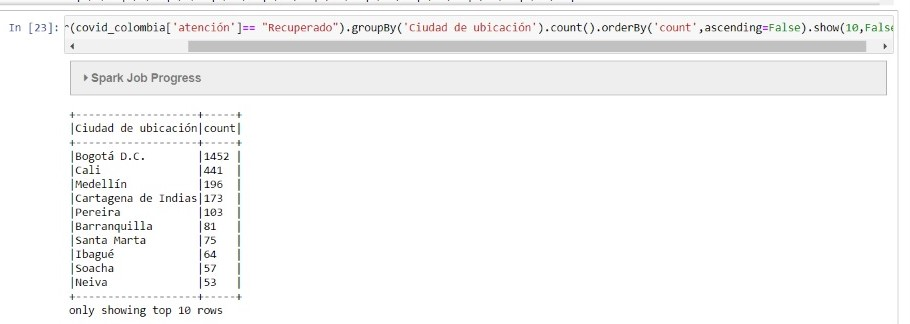

## Proyecto3-TET
## Universidad EAFIT
## Curso ST0263 Tópicos Especiales en Telemática, 2020-1
## Profesor: Edwin Montoya M. – emontoya@eafit.edu.co

## TRABAJO 3 - SPARK sobre COVID-19

## Intgrantes:
- Kevyn Santiago Gómez Patiño
- Santiago Castrillon Galvis

## Analisis exploratorio de datos sobre datasets de COVID-19:

## 1. Fuentes de datos

### a nivel mundial:

https://data.humdata.org/dataset/novel-coronavirus-2019-ncov-cases

### a nivel colombia:

https://data.humdata.org/dataset/positive-cases-of-covid-19-in-colombia

## 2. Ingesta y Almacenamiento de datos
- Se crea el bucket
 
- Se cargan los datasets
 

- Se realiza la ingesta 

- Notebook:

## 3. Procesamiento: Análisis exploratorio de datos con pyspark

### análisis descriptivo exploratorio

Fallecidos por sexo:

Personas recuperadas por ciudad:

Casos en situación de estudio por departamento:

Personas menores de 25 años fallecidas por departamento:

Personas mayores de 25 años fallecidas por departamento:

## 4. Visualización básica de datos

### 4.1 situación a nivel mundial

### 4.2 Situación en Colombia

### 4.3 Colombia vs Mundo

